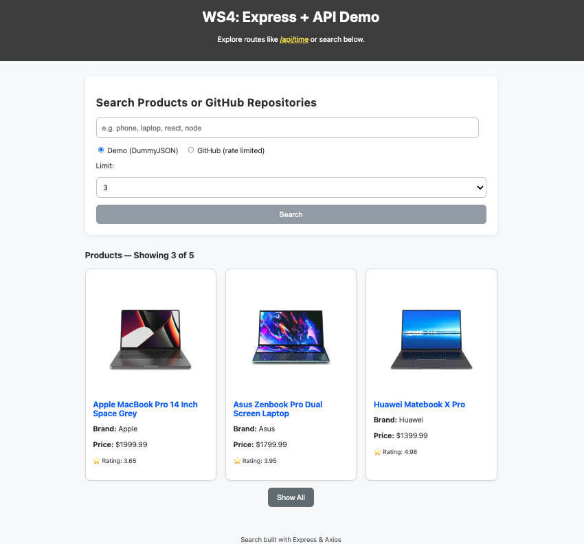
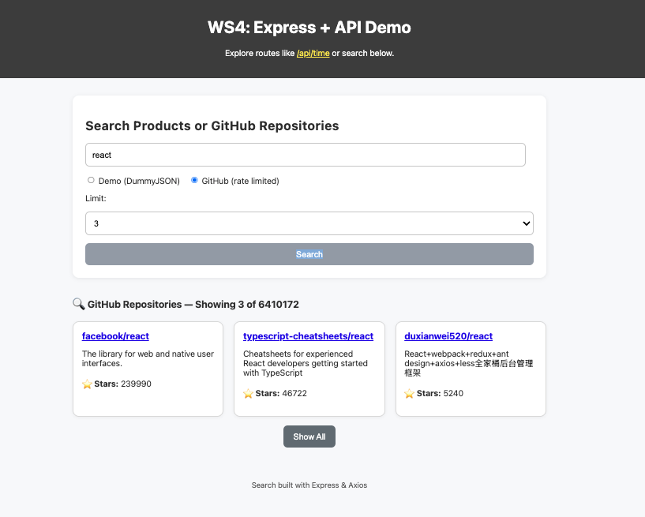

# WS4 Express + Axios Search Demo

> A simple full-stack demo using **Express.js** on the backend and **Axios** for fetching live data from external APIs (GitHub Repositories and DummyJSON Products).  
It also includes a polished frontend UI that allows users to search, choose a source, limit results, and toggle **Show Less / Show All**.

> **View the live website link [here](https://femi-axios-search.onrender.com/)**

---
## Front page
| DummyJSON Products| GitHub Repositories|
|-------------|--------------|
|  |  |

---

##  Features

### Backend (Express + Axios)
- Serves static files from `/public`
- API routes under `/api`:
  - `/api/time` → returns the current server time
  - `/api/search` → performs live search from:
    - **DummyJSON API** (products)
    - **GitHub API** (repositories)
- Accepts query parameters:
  - `q` — search term
  - `src` — `"demo"` (DummyJSON) or `"github"`
  - `limit` — number of results to show (default: 3)
  - `showAll` — `"true"` to return all results
- Built-in error handling with rate-limit fallback messages

### Frontend (HTML + JS + CSS)
- Responsive layout with a clean, modern design
- Search form with options:
  - Choose source (Demo or GitHub)
  - Set number of items to fetch
- Results displayed as **cards**, not raw JSON
- Dynamic **Show More / Show Less** toggle
- Handling of API errors and loading state

---

## Tech Stack

| Layer | Technology |
|--------|-------------|
| **Frontend** | HTML5, CSS3, Vanilla JavaScript |
| **Backend** | Node.js (Express.js 5) |
| **API Requests** | Axios |
| **External APIs** | DummyJSON, GitHub REST API |
| **Styling** | Custom modern CSS cards |

---

## Project Structure

```bash
├── public/
│   ├── index.html
│   ├── app.js
│   └── style.css
├── package-lock.json
├── package.json
├── server.js
└── README.md
```

---

## Installation & Setup

### Clone this repository
```bash
git clone https://github.com/FemiAdesola/WS-FullStack.git
cd WS-FullStack/WS4
```

### Install dependencies
```bash
npm install
```

### Start the server
```bash
npm start
or
node server.js
```
By default, the app will run at:
```
http://localhost:3000
```
---

## API Endpoints

### `/api/time`
Returns the server’s current time.
```bash
GET /api/time
```

**Response:**
```json
{ "now": "2025-10-23T13:45:12.123Z" }
```
---

### `/api/search`
Performs a search on either **DummyJSON** or **GitHub**.

**Query Parameters:**
| Param | Type | Default | Description |
|--------|------|----------|-------------|
| `q` | string | `"phone"` | Search term |
| `src` | string | `"demo"` | `"demo"` or `"github"` |
| `limit` | number | `6` | Limit number of results |
| `showAll` | boolean | `false` | Return all available results |

**Example:**
```bash
GET /api/search?q=laptop&src=demo&limit=6
```

**Response Example (Demo Source):**
```json
{
  "source": "demo",
  "total": 90,
  "limit": 6,
  "showAll": false,
  "items": [
    {
      "title": "Laptop XYZ",
      "price": 1200,
      "brand": "BrandName",
      "rating": 4.5,
      "thumbnail": "https://i.dummyjson.com/data/laptop.jpg"
    }
  ]
}
```
---
## Usage

1. Open the app in your browser.
2. Enter a search term (e.g. *laptop*, *react*, *node*).
3. Choose a data source:
   - **Demo (DummyJSON)** → Fetches sample product data.
   - **GitHub** → Searches repositories on GitHub (may be rate-limited).
4. Click **Search** — results will appear as stylish cards.

Example routes:
- `/api/time` → returns server time.
- `/api/search?q=react&src=github` → returns GitHub repos.
- `/api/search?q=phone&src=demo` → returns product results.

---

## Frontend Features

| Feature | Description |
|----------|-------------|
| **Search Bar** | Enter a term (e.g., “phone”, “react”) |
| **Source Toggle** | Choose between DummyJSON or GitHub |
| **Limit Selector** | Choose how many items to show |
| **Show More / Less** | Toggle to view all or limited results |
| **Styled Cards** | Results are shown in beautiful, responsive cards |
| **Dynamic Updates** | No page reload — results update instantly |

---

## Example URLs

- [http://localhost:3000/api/time](http://localhost:3000/api/time)
- [http://localhost:3000/api/search?q=react&src=github](http://localhost:3000/api/search?q=react&src=github)
- [http://localhost:3000/api/search?q=phone&src=demo&limit=10](http://localhost:3000/api/search?q=phone&src=demo&limit=10)

---

## Author

Created as part of **WS4 Fullstack Exercise** using Express + Axios.
